<div align="center">

# � ChoyAI: Enterprise-Grade AI Productivity Suite

[](https://www.python.org/downloads/)
[](https://opensource.org/licenses/MIT)
[](https://www.docker.com/)
[](https://core.telegram.org/bots)
[](https://openai.com/)
[](https://github.com/shanchoynoor/ChoyAI)

**🚀 Advanced Personal AI Assistant with 14-Module Productivity Ecosystem**

*Enterprise-grade productivity suite featuring sophisticated AI-powered modules for personal and business automation. Built with cost-efficiency in mind, integrating multiple free APIs and minimal paid services to deliver maximum value with minimal operational costs.*

[📚 Documentation](#-documentation) • [🚀 Quick Start](#-quick-start) • [⚙️ Configuration](#️-configuration) • [🏗️ Architecture](#️-architecture) • [🤝 Contributing](#-contributing)

---

</div>

## 🌟 Key Features

<table>
<tr>
<td width="50%">

### 🧠 **Intelligent Core**
- **🎯 Long-term Memory**: Persistent user memories with semantic search
- **🎭 Multiple Personas**: Switch between AI personalities (Choy, Tony, Rose)
- **🔄 Context Awareness**: Maintains conversation context across sessions
- **🧩 Strategic Thinking**: AI that remembers and builds upon interactions
- **💰 Cost-Optimized**: Smart API usage with free-tier maximization

### 🤖 **Multi-Provider AI System**
- **⚡ Provider Management**: Multiple AI providers with automatic failover
- **🎯 Task-Specific Routing**: Optimized providers for different task types
- **📊 Performance Monitoring**: Real-time health checking and metrics
- **⚙️ Flexible Configuration**: Easy provider switching based on preferences
- **💸 Cost Control**: DeepSeek primary, OpenAI/Claude fallback

</td>
<td width="50%">

### 📋 **14-Module Productivity Suite**
- **📝 Tasks & Notes**: Local management with AI scoring
- **📅 Calendar & Reminders**: Google Calendar smart scheduling
- **📧 Email Assistant**: Gmail API with AI-powered drafting
- **📰 News Aggregator**: RSS feeds with AI summarization
- **💰 Finance Tracker**: Google Sheets expense tracking
- **📊 Project Management**: ClickUp/Trello AI task management
- **📈 Trading Analysis**: CoinGecko + TradingView insights
- **🌐 Social Media**: Multi-platform content management
- **☎️ Voice Processing**: Whisper API transcription
- **🤖 Online Agent**: Service automation for bookings

### 💬 **Communication**
- **📱 Telegram Bot**: Full-featured integration
- **💭 Natural Conversations**: Context-aware responses
- **🧠 Memory Commands**: Save, recall, manage information
- **🎭 Persona Switching**: Real-time personality changes

</td>
</tr>
</table>

## 🎭 Available Personas

<div align="center">

| Persona | Style | Specialization | Use Case |
|---------|-------|----------------|----------|
| **🎯 Choy** | Confident, Strategic, Direct | Business & Leadership | Primary assistant, strategic decisions |
| **🔧 Tony** | Tech Genius, Sarcastic, Innovative | Technical & Development | Programming, system architecture |
| **🌸 Rose** | Warm, Empathetic, Supportive | Emotional & Personal | Support, guidance, personal matters |

</div>

---

## 🚀 Quick Start

### 📋 Prerequisites

<table>
<tr>
<td width="50%">

**🔧 System Requirements**
- Ubuntu/Debian/CentOS server
- 2GB+ RAM, 10GB+ storage
- Python 3.11+ (auto-installed)
- Docker (auto-installed)

</td>
<td width="50%">

**🔑 Required API Keys**
- Telegram Bot Token ([@BotFather](https://t.me/botfather))
- DeepSeek API Key (recommended)
- OpenAI/Anthropic/xAI (optional)
- Google APIs (optional modules)

</td>
</tr>
</table>

### ⚡ Installation Options

<details>
<summary><b>🚀 Option 1: One-Command VPS Setup (Recommended)</b></summary>

For complete VPS deployment with all dependencies:

```bash
# Clone and setup everything automatically
git clone https://github.com/shanchoynoor/ChoyAI.git
cd ChoyAI

# Complete VPS setup with all dependencies
make vps-setup    # Installs Python, Docker, dependencies, configures VPS
make setup        # Configure environment and API keys
make deploy       # Deploy ChoyAI with Docker

# View status
make status       # Check deployment status
make logs         # Monitor application logs
```

</details>

<details>
<summary><b>💻 Option 2: Local Development Setup</b></summary>

For local development or existing systems:

```bash
# Clone the repository
git clone https://github.com/shanchoynoor/ChoyAI.git
cd ChoyAI

# Setup environment and dependencies
make setup        # Sets up Python dependencies and creates .env
make setup-env    # Interactive environment configuration

# Start ChoyAI
make start        # Start with Docker
# OR
python main.py    # Run directly
```

</details>

<details>
<summary><b>🔧 Option 3: Manual Installation</b></summary>

For manual setup control:

```bash
# Install dependencies
make install-python    # Install Python 3.11
make install-deps      # Install Python packages  
make install-docker    # Install Docker (optional)

# Configure environment
cp .env.example .env
# Edit .env with your API keys

# Run ChoyAI
make start      # With Docker
# OR  
python main.py  # Direct execution
```

</details>

### 📋 Command Reference

<div align="center">

| Command | Purpose | Description |
|---------|---------|-------------|
| `make help` | 📖 Show all commands | Complete command reference |
| `make vps-setup` | 🖥️ Full VPS setup | Complete server setup |
| `make setup` | ⚙️ Configure environment | Setup dependencies and .env |
| `make deploy` | 🚀 Deploy ChoyAI | Deploy with Docker |
| `make status` | 📊 Check services | View running status |
| `make logs` | 📋 View logs | Monitor application logs |
| `make backup` | 💾 Create backup | Backup data and config |
| `make health` | 🏥 Health check | Verify system health |
| `make update` | 🔄 Update system | Pull code and restart |

</div>

## ⚙️ Configuration

### 🔧 Environment Variables

Create a `.env` file with the following configuration:

<details>
<summary><b>📝 Required Configuration</b></summary>

```bash
# Core Configuration
TELEGRAM_BOT_TOKEN=your_telegram_bot_token_here
DEEPSEEK_API_KEY=your_deepseek_api_key_here

# Application Settings
DEFAULT_PERSONA=choy
LOG_LEVEL=INFO
MAX_CONVERSATION_HISTORY=50

# Optional AI Providers
OPENAI_API_KEY=your_openai_api_key_here
ANTHROPIC_API_KEY=your_anthropic_api_key_here
XAI_API_KEY=your_xai_api_key_here
GOOGLE_AI_API_KEY=your_google_ai_api_key_here
```

</details>

<details>
<summary><b>🔗 Module-Specific APIs</b></summary>

```bash
# Google Services (Optional Modules)
GOOGLE_CALENDAR_API_KEY=your_calendar_api_key
GMAIL_API_KEY=your_gmail_api_key
GOOGLE_SHEETS_API_KEY=your_sheets_api_key

# Financial & Trading (Optional)
COINGECKO_API_KEY=your_coingecko_api_key

# Social Media (Optional)
TWITTER_API_KEY=your_twitter_api_key
FACEBOOK_API_KEY=your_facebook_api_key

# Project Management (Optional)
CLICKUP_API_KEY=your_clickup_api_key
TRELLO_API_KEY=your_trello_api_key
```

</details>

### 🎭 Personas Configuration

Personas are defined in YAML files in the `templates/personas/` directory:

```yaml
# Example: templates/personas/choy.yaml
name: "Choy"
description: "Confident, strategic AI assistant"
system_prompt: |
  You are Choy, a confident and strategic AI assistant...
traits:
  - confident
  - strategic  
  - direct
response_style:
  temperature: 0.7
  max_tokens: 1000
```

## 🎯 Usage Guide

### 📱 Telegram Bot Commands

<div align="center">

<table>
<tr>
<th>Category</th>
<th>Command</th>
<th>Description</th>
<th>Example</th>
</tr>
<tr>
<td rowspan="4"><b>🎭 Personas</b></td>
<td><code>/start</code></td>
<td>Welcome message and overview</td>
<td><code>/start</code></td>
</tr>
<tr>
<td><code>/persona &lt;name&gt;</code></td>
<td>Switch AI personality</td>
<td><code>/persona tony</code></td>
</tr>
<tr>
<td><code>/personas</code></td>
<td>List available personalities</td>
<td><code>/personas</code></td>
</tr>
<tr>
<td><code>/bio &lt;text&gt;</code></td>
<td>Set user biography</td>
<td><code>/bio Software engineer</code></td>
</tr>
<tr>
<td rowspan="4"><b>🧠 Memory</b></td>
<td><code>/remember &lt;key&gt; &lt;value&gt;</code></td>
<td>Save a memory</td>
<td><code>/remember favorite_color blue</code></td>
</tr>
<tr>
<td><code>/recall &lt;key&gt;</code></td>
<td>Retrieve a memory</td>
<td><code>/recall favorite_color</code></td>
</tr>
<tr>
<td><code>/memories</code></td>
<td>List all memories</td>
<td><code>/memories</code></td>
</tr>
<tr>
<td><code>/history</code></td>
<td>View conversation history</td>
<td><code>/history</code></td>
</tr>
<tr>
<td rowspan="3"><b>🤖 AI Providers</b></td>
<td><code>/providers</code></td>
<td>Show AI providers status</td>
<td><code>/providers</code></td>
</tr>
<tr>
<td><code>/switchai &lt;task&gt; &lt;provider&gt;</code></td>
<td>Switch AI provider for tasks</td>
<td><code>/switchai creative openai</code></td>
</tr>
<tr>
<td><code>/stats</code></td>
<td>View AI usage statistics</td>
<td><code>/stats</code></td>
</tr>
</table>

</div>

### 🎯 Task Types & Optimal Providers

<div align="center">

| Task Type | Best For | Optimal Provider | Fallback |
|-----------|----------|------------------|----------|
| `conversation` | General chat | DeepSeek | OpenAI, Claude |
| `technical` | Programming questions | DeepSeek | OpenAI, xAI |
| `creative` | Writing, storytelling | OpenAI | Claude, DeepSeek |
| `analysis` | Deep analysis, research | Claude | OpenAI, DeepSeek |
| `coding` | Code generation | DeepSeek | OpenAI, Claude |
| `emotional` | Emotional support | Claude | OpenAI, DeepSeek |

</div>

### 💬 Natural Conversation

Simply chat naturally! ChoyAI will:

- ✅ **Remember** important details automatically
- ✅ **Reference** past conversations contextually  
- ✅ **Adapt** responses based on active persona
- ✅ **Provide** personalized assistance over time
- ✅ **Learn** your preferences and communication style

## 🏗️ Architecture

```mermaid
graph TB
    subgraph "🌐 User Interface"
        TG[📱 Telegram Bot]
        API[🔌 REST API]
    end
    
    subgraph "🧠 Core AI Engine"
        AIE[🤖 AI Engine]
        PM[🎭 Persona Manager]
        PRM[🔄 Provider Manager]
    end
    
    subgraph "💾 Memory System"
        CM[🧠 Core Memory]
        UM[👤 User Memory]
        VM[🔄 Vector Memory]
    end
    
    subgraph "📋 14 Productivity Modules"
        TASKS[📝 Tasks/Notes]
        CAL[📅 Calendar]
        EMAIL[📧 Email]
        NEWS[📰 News]
        FIN[💰 Finance]
        PROJ[📊 Projects]
        TRADE[📈 Trading]
        SOC[🌐 Social]
        VOICE[☎️ Voice]
        AGENT[🤖 Agent]
    end
    
    subgraph "🔗 External APIs"
        GOOGLE[📊 Google APIs]
        OPENAI[🤖 OpenAI]
        DEEPSEEK[⚡ DeepSeek]
        SOCIAL_API[📱 Social APIs]
        FINANCE_API[💰 Finance APIs]
    end
    
    TG --> AIE
    API --> AIE
    AIE --> PM
    AIE --> PRM
    AIE --> CM
    AIE --> UM
    AIE --> VM
    AIE --> TASKS
    AIE --> CAL
    AIE --> EMAIL
    
    TASKS --> GOOGLE
    CAL --> GOOGLE
    EMAIL --> GOOGLE
    VOICE --> OPENAI
    AIE --> DEEPSEEK
    SOC --> SOCIAL_API
    FIN --> FINANCE_API
```

<div align="center">



</div>

### 🧩 System Components

<table>
<tr>
<td width="50%">

**🤖 Core AI Engine**
- Multi-provider orchestration
- Task-specific routing
- Cost optimization
- Automatic failover
- Performance monitoring

**💾 3-Layer Memory System**
- **Core Memory**: System knowledge
- **User Memory**: Personal preferences  
- **Vector Memory**: Semantic search
- **Conversation**: Session context

</td>
<td width="50%">

**📋 Modular Architecture**
- Clean separation of concerns
- Pluggable components
- Independent module scaling
- Unified API interfaces
- Hot-swappable personas

**🔗 Integration Layer**
- Unified API management
- Fallback mechanisms  
- Rate limiting & caching
- Error handling & retry logic
- Cost tracking & optimization

</td>
</tr>
</table>

### 📁 Project Structure

```
ChoyAI/
├── 🚀 app/                      # Main application
│   ├── 🧠 core/                 # Core AI engine & providers
│   ├── 📋 modules/              # 14 Productivity modules
│   │   ├── 💾 memory/           # Memory management system
│   │   ├── 🎭 personas/         # Multi-personality system
│   │   ├── 💬 chat/             # Chat processing
│   │   └── ⚡ productivity/     # Productivity suite modules
│   ├── 🔗 integrations/         # External API integrations
│   ├── ⚙️ config/              # Configuration management
│   └── 🛠️ utils/               # Utilities & helpers
├── 💾 data/                     # Data storage
│   ├── 🎭 personas/            # Persona definitions
│   ├── 🗄️ databases/           # SQLite databases  
│   ├── 🧠 core_memory/         # Core memory storage
│   └── 📋 logs/                # Application logs
├── 🐳 config/                   # Docker & deployment
├── 📚 docs/                     # Documentation
├── 🧪 tests/                    # Test suites
└── 🛠️ tools/                   # Utility scripts
```

## 🔮 ChoyAI: Cost-Effective Productivity Suite

### 💡 14 Planned Modules – Cost-Efficient Design

| Module # | Feature | API / Tool Used | Cost |
|----------|---------|-----------------|------|
| 1 | **Chat / Voice** | GPT-4o / Claude / DeepSeek | Already owned |
| 2 | **Reminders / Calendar** | Google Calendar API + GPT-4o logic | Free (low use) |
| 3 | **Tasks / To-Do** (Google Tasks) | Local DB + GPT-4o (for scoring/intent) | Free (local) |
| 4 | **Notes** (Google Keep) | Local DB + GPT-4o summarization | Free |
| 5 | **Cloud Drive** (Google Drive) | Supabase / Firebase + Vector embeddings | Free tier |
| 6 | **News** | RSS feeds + GPT-4o summarizer | Free |
| 7 | **Mail** | Gmail API + GPT-4o drafting engine | Free (limited) |
| 8 | **Messaging Hub** | Telegram Bot API / WhatsApp API | Telegram free, WhatsApp paid |
| 9 | **Call** | OpenAI Whisper API for STT | ~$0.006/min |
| 10 | **Social Media** | X, FB, IG APIs + GPT-4o content generator | Free/basic use |
| 11 | **Accounts / Finance** | Google Sheets API + GPT-4o summarizer | Free |
| 12 | **Project Management** | Trello or ClickUp API + GPT-4o task manager | Free |
| 13 | **Trading Analysis** | CoinGecko API + TradingView API + GPT-4o summarization | Free |
| 14 | **Online Agent** | Uber, Booking, etc. APIs + GPT-4o logic | Free/dev accounts |

### 🔧 Minimal External APIs (Must-Have Only)

| API | Purpose | Cost |
|-----|---------|------|
| **OpenAI Whisper** | Voice transcription | ~$0.006/min |
| **Google Calendar API** | Reminder scheduling | Free |
| **Google Sheets API** | Expense/Budget tracking | Free |
| **Supabase / Firebase** | File, task, note storage | Free tier |
| **Telegram Bot API** | Interface layer | Free |
| **CoinGecko API** | Crypto prices and updates | Free |
| **Gmail API** | Email access and automation | Free |

### 🚀 Final API Stack for ChoyAI: v1 Power Boost

| Purpose | API / Tool | Status |
|---------|------------|--------|
| **Web Search** | ✅ Serper / Perplexity | Ready |
| **Voice → Text** | ✅ Whisper API | Ready |
| **Text → Voice** | ✅ ElevenLabs or Google TTS | Ready |
| **YouTube Search** | ✅ YouTube API | Ready |
| **News** | ✅ RSS Feeds | Ready |
| **Crypto/Finance** | ✅ CoinGecko | Ready |
| **Map & Location** | ✅ Google Maps | Ready |
| **Memory** | ✅ ChromaDB + SQLite | Implemented |
| **Assistant Brain** | ✅ ChatGPT + DeepSeek | Implemented |

### 📋 Current Implementation Status

| Module | Status | Features | API Integration |
|--------|--------|----------|-----------------|
| **🧠 Core AI** | ✅ **Complete** | Multi-provider, memory, personas | DeepSeek/OpenAI/Claude |
| **� Chat/Voice** | ✅ **Complete** | Telegram bot, personality switching | Telegram Bot API |
| **🧠 Memory System** | ✅ **Complete** | 3-layer memory, semantic search | ChromaDB + SQLite |
| **🎭 Personas** | ✅ **Complete** | Multiple personalities, YAML configs | Local implementation |
| **📝 Tasks/Notes** | 🚧 **In Progress** | Local task management, AI scoring | Local DB + GPT logic |
| **� Calendar** | 📋 **Planned** | Smart scheduling, reminders | Google Calendar API |
| **📧 Email** | 📋 **Planned** | AI-powered drafting, management | Gmail API |
| **📰 News** | 📋 **Planned** | RSS aggregation, AI summarization | RSS + GPT |
| **💰 Finance** | 📋 **Planned** | Expense tracking, budget insights | Google Sheets API |
| **📊 Projects** | 📋 **Planned** | Task management, progress tracking | ClickUp/Trello API |
| **📈 Trading** | 📋 **Planned** | Market analysis, crypto tracking | CoinGecko + TradingView |
| **🌐 Social** | � **Planned** | Content management, posting | Social Media APIs |
| **☎️ Voice Calls** | 📋 **Planned** | Voice transcription, responses | Whisper API |
| **🤖 Online Agent** | 📋 **Planned** | Service automation, bookings | Various APIs |

### 🎯 Module Integration Framework

Each module follows a standardized integration pattern:

```python
class ModuleInterface:
    - OAuth/API authentication
    - Webhook support for real-time updates  
    - Unified command interface
    - Memory integration for context sharing
    - Cost-optimized API usage
    - Fallback mechanisms
```

### 💰 Cost Optimization Strategy

1. **Primary Free APIs**: Google Calendar, Sheets, Gmail, Telegram
2. **Minimal Paid APIs**: Only Whisper for voice (~$0.006/min)
3. **Local Processing**: Tasks, notes, and memory stored locally
4. **Smart Caching**: Reduce API calls with intelligent caching
5. **Batch Operations**: Group API requests to minimize costs
6. **Free Tiers**: Maximize usage of free API tiers

## 📊 Advanced Memory System

<div align="center">

### 🧠 **Three-Layer Memory Architecture**

*Sophisticated memory management for context-aware AI interactions*

</div>

<table>
<tr>
<td width="33%">

### 🎯 **Core Memory**
- System facts & capabilities
- Permanent knowledge base
- AI personality traits
- Technical specifications
- Global configurations

</td>
<td width="33%">

### 👤 **User Memory**
- Personal preferences
- Custom memories
- User biography
- Interaction history
- Relationship context

</td>
<td width="33%">

### 💬 **Conversation Memory**
- Session context
- Chat history
- Active topics
- Reference chains
- Dynamic state

</td>
</tr>
</table>

### 🚀 Memory Features

- ✅ **Automatic Extraction**: Important information is automatically saved
- ✅ **Manual Commands**: Users can explicitly save/recall memories  
- ✅ **Semantic Search**: Find relevant memories using natural language
- ✅ **Context Integration**: Memories are automatically included in AI responses
- ✅ **Vector Embeddings**: Advanced similarity matching for context retrieval
- ✅ **Privacy Controls**: Local storage with complete user data control

---

## 🔒 Security & Privacy

<div align="center">

### 🛡️ **Enterprise-Grade Security**

*Your data, your control - complete privacy by design*

</div>

<table>
<tr>
<td width="50%">

### 🔐 **Security Features**
- **Rate Limiting**: Prevents abuse with configurable limits
- **User Validation**: Optional allowlists for private deployment
- **Data Encryption**: Sensitive data properly secured
- **Input Sanitization**: Protection against malicious inputs
- **API Key Security**: Secure credential management

</td>
<td width="50%">

### 🔒 **Privacy Guarantees**
- **Local Storage**: All data stored locally in SQLite
- **No Cloud Dependencies**: Complete control over your data
- **Zero Telemetry**: No data collection or tracking
- **Open Source**: Full transparency and auditability
- **Self-Hosted**: Deploy on your own infrastructure

</td>
</tr>
</table>

## 🚀 Deployment & Operations

<div align="center">

### 🎯 **Production-Ready Deployment Options**

*Choose your deployment strategy - from local development to enterprise production*

</div>

### 🖥️ VPS Deployment (Recommended)

<details>
<summary><b>🚀 One-Command Production Setup</b></summary>

```bash
# Complete VPS setup with monitoring and backup
git clone https://github.com/shanchoynoor/ChoyAI.git
cd ChoyAI

make vps-setup           # Install all dependencies
make setup               # Configure environment
make deploy-production   # Deploy with backup systems
make health             # Verify deployment
```

**Features:**
- ✅ Automatic dependency installation (Python 3.11, Docker, Redis)
- ✅ SSL certificate setup with Let's Encrypt
- ✅ Nginx reverse proxy configuration
- ✅ Automated backup systems
- ✅ Health monitoring and alerting
- ✅ Log rotation and management

</details>

### 🐳 Docker Deployment

<details>
<summary><b>🐳 Docker Compose Production</b></summary>

```bash
# Production Docker setup
git clone https://github.com/shanchoynoor/ChoyAI.git
cd ChoyAI

# Build and deploy
make build        # Build optimized Docker image
make start        # Start with Docker Compose
make status       # Check deployment status
make logs         # Monitor logs
```

**Docker Features:**
- ✅ Multi-stage builds for optimized images
- ✅ Health checks and auto-restart
- ✅ Volume management for persistent data
- ✅ Network isolation and security
- ✅ Resource limits and monitoring

</details>

### 💻 Local Development

<details>
<summary><b>💻 Development Environment</b></summary>

```bash
# Local development setup
git clone https://github.com/shanchoynoor/ChoyAI.git
cd ChoyAI

# Setup development environment
make setup-dev    # Install dev dependencies
make test         # Run test suite
make lint         # Code quality checks

# Run in development mode
python main.py --dev    # Development mode with hot reload
make dev                # Alternative development command
```

**Development Features:**
- ✅ Hot reload for rapid development
- ✅ Debug logging and error tracking
- ✅ Test suite with coverage reporting
- ✅ Code formatting and linting
- ✅ Pre-commit hooks for quality assurance

</details>

### 📊 Monitoring & Maintenance

<table>
<tr>
<td width="50%">

### 📈 **Built-in Monitoring**
- Real-time performance metrics
- API usage tracking and analytics
- Memory usage and optimization
- Error rate monitoring and alerting
- User interaction analytics

### 🔧 **Maintenance Tools**
- Automated backup creation
- Database optimization utilities
- Log management and rotation
- Health check endpoints
- System status reporting

</td>
<td width="50%">

### 🛠️ **Operations Commands**
```bash
make health              # System health check
make backup             # Create data backup
make restore            # Restore from backup
make update-production  # Safe production updates
make scale-up          # Scale for high load
make monitoring        # View monitoring dashboard
```

### 📋 **Production Checklist**
- ✅ Environment variables configured
- ✅ SSL certificates installed
- ✅ Backup systems active
- ✅ Monitoring alerts configured
- ✅ Security hardening applied

</td>
</tr>
</table>

### 📋 Post-Deployment Module Setup

<details>
<summary><b>📋 Module Activation Guide</b></summary>

After deployment, modules activate automatically when their required APIs are configured:

```bash
# Setup individual modules (when APIs are ready)
make productivity-setup   # Initialize all 14 modules
make test-modules        # Test module functionality
make module-status       # Check activation status
```

**Module Activation Matrix:**

| Module | Auto-Activate When | Status | Dependencies |
|--------|-------------------|--------|--------------|
| **🧠 Core AI** | DeepSeek/OpenAI API set | ✅ Active | AI API keys |
| **💾 Memory** | Always (local storage) | ✅ Active | SQLite |
| **📱 Telegram** | TELEGRAM_BOT_TOKEN set | ✅ Active | Telegram API |
| **📝 Tasks** | Always (local storage) | ✅ Active | Local DB |
| **📅 Calendar** | GOOGLE_CALENDAR_API_KEY | 📋 Ready | Google API |
| **📧 Email** | GMAIL_API_KEY set | 📋 Ready | Gmail API |
| **☎️ Voice** | OPENAI_API_KEY set | 📋 Ready | Whisper API |
| **💰 Finance** | GOOGLE_SHEETS_API_KEY | 📋 Ready | Sheets API |
| **📰 News** | Always (RSS feeds) | 📋 Ready | RSS |
| **📈 Trading** | COINGECKO_API_KEY set | 📋 Ready | CoinGecko |

</details>

---

## 📈 Performance & Monitoring

<div align="center">

### � **Enterprise-Grade Monitoring**

*Comprehensive performance tracking and system health monitoring*

</div>

<table>
<tr>
<td width="50%">

### 📊 **Performance Metrics**
- Response time tracking
- Message processing rates
- Memory usage optimization
- API call efficiency
- User interaction analytics

### 🔍 **System Health**
- Automatic health monitoring
- Proactive error detection
- Resource usage tracking
- Database performance
- Network connectivity

</td>
<td width="50%">

### 📋 **Logging & Analytics**
- Structured JSON logging
- Error tracking and reporting
- User behavior analytics
- Cost optimization insights
- Performance bottleneck detection

### 🚨 **Alerting System**
- Real-time error alerts
- Performance threshold monitoring
- API quota warnings
- System resource alerts
- Custom alert configurations

</td>
</tr>
</table>

## 🤝 Contributing

<div align="center">

### 🌟 **Join the ChoyAI Community**

*We welcome contributions from developers, designers, and productivity enthusiasts*

</div>

### 🚀 Getting Started

<table>
<tr>
<td width="50%">

**🔧 For Developers**
1. Fork the repository
2. Create a feature branch (`git checkout -b feature/amazing-feature`)
3. Make your changes with tests
4. Ensure code quality (`make lint`, `make test`)
5. Submit a pull request

**📋 Development Standards**
- Follow PEP 8 style guidelines
- Write comprehensive tests
- Document new features
- Use conventional commits
- Update documentation

</td>
<td width="50%">

**🎯 Contribution Areas**
- **🤖 AI Providers**: Add new AI provider integrations
- **📋 Modules**: Develop new productivity modules
- **🎭 Personas**: Create new AI personalities
- **🔧 Tools**: Build developer utilities
- **📚 Documentation**: Improve guides and examples

**💡 Feature Requests**
- Open GitHub issues for feature requests
- Join discussions for community feedback
- Propose new integrations
- Suggest performance improvements

</td>
</tr>
</table>

### 📋 Development Setup

```bash
# Clone and setup development environment
git clone https://github.com/shanchoynoor/ChoyAI.git
cd ChoyAI

# Install development dependencies
make setup-dev

# Run tests and quality checks
make test          # Run test suite
make lint          # Code linting
make coverage      # Test coverage report
make docs          # Generate documentation
```

---

## 📄 License & Legal

<div align="center">

[](https://opensource.org/licenses/MIT)

**ChoyAI is released under the MIT License**

*Free to use, modify, and distribute for personal and commercial projects*

</div>

### 📜 License Terms

- ✅ **Commercial Use**: Use ChoyAI in commercial projects
- ✅ **Modification**: Modify and customize the codebase
- ✅ **Distribution**: Distribute modified or unmodified versions
- ✅ **Private Use**: Use in private projects and environments
- ⚠️ **Attribution**: Include original copyright notice
- ⚠️ **No Warranty**: Software provided "as is" without warranty

See the [LICENSE](LICENSE) file for complete details.

---

## 🆘 Support & Resources

<div align="center">

### 🎯 **Get Help & Stay Connected**

*Multiple channels for support, learning, and community engagement*

</div>

<table>
<tr>
<td width="50%">

### 📚 **Documentation**
- **📖 [Installation Guide](docs/DEPLOYMENT_GUIDE.md)**
- **⚙️ [Configuration Reference](docs/DEVELOPER_REQUIREMENTS.md)**
- **🎭 [Persona Development](docs/SYSTEM_STATUS.md)**
- **🔧 [API Integration](docs/GOOGLE_INTEGRATION_GUIDE.md)**
- **🐳 [Docker Setup](docs/DOCKER.md)**

### 🐛 **Issue Reporting**
- **Bug Reports**: Use GitHub Issues
- **Feature Requests**: GitHub Discussions
- **Security Issues**: Email maintainers
- **Performance Issues**: Include logs and metrics

</td>
<td width="50%">

### 💬 **Community**
- **🐙 GitHub Discussions**: Technical discussions
- **📧 Email Support**: Direct developer contact
- **📋 Wiki**: Community-driven documentation
- **🔄 Updates**: Watch repository for releases

### 🚀 **Quick Links**
- [🏠 Homepage](https://github.com/shanchoynoor/ChoyAI)
- [📋 Issues](https://github.com/shanchoynoor/ChoyAI/issues)
- [🔄 Releases](https://github.com/shanchoynoor/ChoyAI/releases)
- [📊 Projects](https://github.com/shanchoynoor/ChoyAI/projects)

</td>
</tr>
</table>

## 🎯 Vision & Roadmap

<div align="center">

### 🚀 **The Future of Cost-Effective Productivity**

*ChoyAI represents the evolution toward intelligent, affordable, and privacy-focused productivity automation*

</div>

### 🎯 Our Mission

ChoyAI serves as the foundation for a **cost-effective productivity ecosystem** that maximizes value while minimizing operational costs. We're building an intelligent system that:

<table>
<tr>
<td width="50%">

### 🧠 **Intelligent Evolution**
- **Deep Learning**: Builds comprehensive understanding of each user
- **Memory Systems**: Advanced 3-layer memory architecture
- **Context Awareness**: Maintains long-term conversation context
- **Adaptive Behavior**: Learns and improves over time
- **Predictive Assistance**: Anticipates user needs

### 🔗 **Universal Integration**
- **14+ Digital Tools**: Unified AI intelligence across platforms
- **API Orchestration**: Seamless service coordination
- **Workflow Automation**: Cross-platform task automation
- **Data Synchronization**: Unified data management
- **Smart Routing**: Optimal service selection

</td>
<td width="50%">

### 💰 **Cost Leadership**
- **90% Free APIs**: Maximum value from free services
- **Smart Optimization**: Intelligent resource management
- **Local Processing**: Reduced cloud dependencies
- **Efficiency Focus**: Minimal operational overhead
- **Scalable Architecture**: Cost-effective growth

### 🔒 **Privacy First**
- **Local Storage**: Complete data control
- **Zero Telemetry**: No data collection
- **Self-Hosted**: Deploy on your infrastructure
- **Open Source**: Full transparency
- **User Sovereignty**: Your data, your rules

</td>
</tr>
</table>

### 🗺️ Development Roadmap

<div align="center">

| Phase | Features | Timeline | Status |
|-------|----------|----------|--------|
| **Phase 1** | Core AI, Memory, Basic Modules | Q1 2025 | ✅ **Complete** |
| **Phase 2** | 14 Productivity Modules | Q2 2025 | 🚧 **In Progress** |
| **Phase 3** | Advanced Integrations | Q3 2025 | 📋 **Planned** |
| **Phase 4** | Enterprise Features | Q4 2025 | 📋 **Planned** |
| **Phase 5** | AI Agent Ecosystem | Q1 2026 | 💭 **Research** |

</div>

### 💡 Core Philosophy

<div align="center">

> **"Maximum productivity shouldn't require maximum spending"**

*ChoyAI proves that enterprise-grade functionality can be delivered through intelligent use of free APIs, local processing, and strategic cost optimization.*

</div>

#### ✅ **Proven Cost Model**
- **14 productivity modules** for the cost of basic AI API usage
- **90% free APIs** (Google, Telegram, CoinGecko, RSS feeds)
- **10% minimal paid** (only Whisper API at ~$0.006/min)
- **Local-first storage** eliminates recurring cloud costs
- **Smart caching** minimizes API usage and expenses

#### 🚀 **Competitive Advantages**
- **Cost Efficiency**: 10x cheaper than comparable solutions
- **Privacy Control**: Complete data sovereignty
- **Customization**: Open-source flexibility
- **Integration Depth**: 14 specialized productivity modules
- **AI Innovation**: Multi-provider orchestration with personas

---

<div align="center">

### 🌟 **Built with ❤️ for Cost-Effective Productivity**

[](https://github.com/shanchoynoor/ChoyAI/stargazers)
[](https://github.com/shanchoynoor/ChoyAI/network/members)
[](https://github.com/shanchoynoor/ChoyAI/issues)
[](https://github.com/shanchoynoor/ChoyAI/pulls)

**[⭐ Star us on GitHub](https://github.com/shanchoynoor/ChoyAI)** • **[🍴 Fork the Project](https://github.com/shanchoynoor/ChoyAI/fork)** • **[🐛 Report Issues](https://github.com/shanchoynoor/ChoyAI/issues)**

---

*Copyright © 2025 ChoyAI Project. Released under the MIT License.*

</div>
